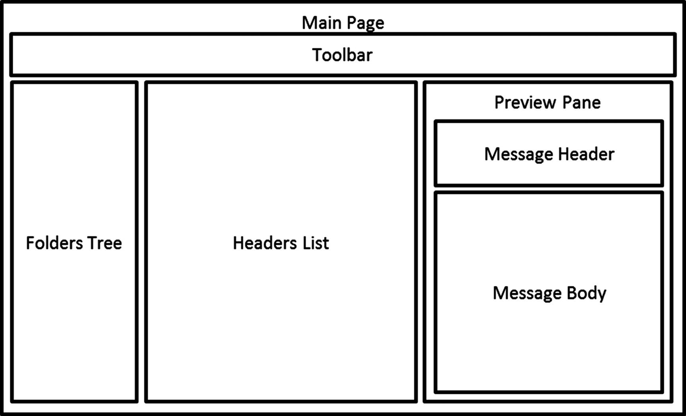

# Lab 1 - Project Setup & Simple Website Automation
In this lab, you get a taste of working with the Selenium Web Driver to automate browsing to a website.

## Create Project Using Spring Initializr
Use the [Spring Initializr](https://start.spring.io/) website to create a base project with the following settings

* Project: Maven Project
* Language: Java
* Spring Boot: default (i.e. 2.2.6)
* Project Metadata
    * Group: com.daugherty
    * Artifact: selenium-playground
    * Name: selenium-playground
    * Package name: com.daugherty.selenium-playground
* Packaging: Jar
* Java (version): 11

Generate the project, unzip and open in IntelliJ.  Verify that all unit tests pass

## Add Dependencies
You will need to add the following dependencies to the pom.xml file

* Selenium
    * groupId: org.seleniumhq.selenium
    * artifact: selenium-java
    * version: 4.0.0-alpha-4 (or greater)
* Web Driver Manager
    * groupId: io.github.bonigarcia
    * artifactId: webdrivermanager
    * version: 3.8.1 (or greater)

## Create a Test to go to Google Website

**Hints**

* Create a unit test class called GoogleTests
* Use the org.testng.annotations.Test annotion to create your test

```
@Test
void canOpenGoogleSiteTest() {
  ...
}
```

* Use the [io.github.bonigarcia.wdm.WebDriverManager](https://github.com/bonigarcia/webdrivermanager) to create a new ChromeDriver. 
* NOTE: you may need to ask about specific set-up for the webdrivers on your work machine

```
WebDriverManager.chromedriver().setup();
WebDriver driver = new ChromeDriver();
```

* Use the WebDriver.get() method to have Selenium browse to the https://www.google.com website

```
driver.get("https://www.google.com);
```

* Use Thread.sleep() method to keep the screen open for 2 seconds
* Use the driver.quit() method to shut down the web driver

## Refactor your code to use @BeforeEach and @AfterEach
Move common components such as the WebDriver setup and shutdown to before and after methods annotated with @BeforeTest and @AfterTest

# Lab 2 - Using the Page Object Pattern
One of the design patterns most commonly used with Selenium is the [Page Object Pattern](https://app.pluralsight.com/guides/getting-started-with-page-object-pattern-for-your-selenium-tests).  With this pattern, you create a class for each page in your user interface and then create methods on that class to perform actions such as entering text in a text box or clicking a particular button.  For more complex user interfaces, you should break the page up into multiple Page Object components.  This pattern enables us to reduce the amount of code for a single class and helps promote reuse when components are the same or similar on other pages.



## Explore the lab 2 starter (this codebase)
* Open the lab2-starter project in your IDE.
* Review all the unit tests and associated code in src/test/java/com.daugherty.seleniumplayground
    * /drivers
        * DriverFactory - a class that uses the static factory design pattern to generate a specific browser WebDriver
        * ChromeDriverFactory, FirefoxDriverFactory, InternetExplorerDriverFactory - classes used by the DriverFactory to create each of the WebDriver objects
    * /pages
        * BasePage
            * Class used to store logic needed by every page.
        * GoogleHomePage
            * Class used to interact with the Google home page
            * Notice how the Selenium WebDriver object is injected using constructor injection into this page and then passed to the base page for later reuse in the ‘webDriver’ field
            * Notice how the go() method returns a GoogleHomePage.  This is a pattern that allows us to chain methods together

```
GoogleHomePage home = new GoogleHomePage(driver);
home.go().search("selenium webdriver");
```

## Implement the go and search methods in GoogleHomePage
* Implement the go() method
    * This method should cause Selenium to navigate to the https://www.google.com page
* Implement the search() method
    * Use the WebDriver findElement method to find the search box, enter the search string and then submit the search


# Lab 3 - Navigate to the search result for Selenium website
* Modify the code to:
    * Wait until the search results appear (tip: use the WebDriverWait class to wait until the page title changes to “selenium webdriver - Google Search”)
    * Find the link with text “Documentation for Selenium”
    * Use Selenium to click on the link which will navigate you to the Selenium website


# Lab 4 - Continue experimenting with a few more challenges like those below
* Go to the 5th page of search results
* Verify the search results page contains some text "About xxxxxxxxx results (x.xx seconds)"
* Go to the image results and select the 4th search result image on the page